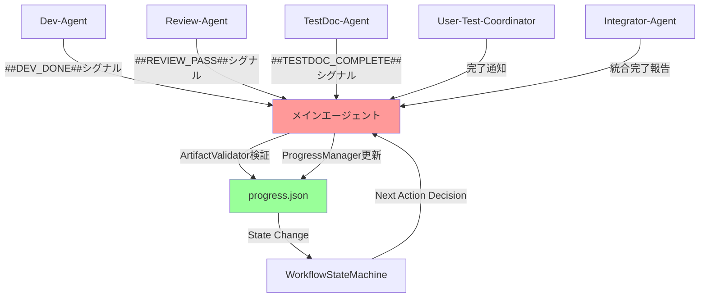

# GameMacroAssistant - AI開発ワークフロー管理システム

## プロジェクト概要
GameMacroAssistantは、Windows 11マクロ自動化ツールの開発プロジェクトです。AIエージェントによる高速な実装・検証ワークフローにより、効率的な開発サイクルを実現します。

## 技術要件
- **言語**: C# (.NET 8)
- **UI Framework**: WPF with MVVM pattern
- **MVVM Library**: CommunityToolkit.Mvvm
- **テスト**: xUnit, Coverlet, ReportGenerator
- **Windows API**: user32.dll, kernel32.dll, dxgi.dll統合
- **アーキテクチャ**: 疎結合設計、依存性注入、SOLID原則

## ディレクトリ構成
```
/
├── src/                    # アプリケーション本体
│   ├── GameMacroAssistant.Core/      # ビジネスロジック層
│   ├── GameMacroAssistant.Wpf/       # プレゼンテーション層
│   └── GameMacroAssistant.Tests/     # 単体・統合テスト
├── docs/                   # プロジェクトドキュメント
│   ├── pm/                 # プロジェクト管理
│   │   ├── tasks/          # TaskGen-Agent生成タスク仕様
│   │   ├── sprints/        # Planner-Agent生成開発計画
│   │   └── progress/       # 進捗管理JSONファイル
│   ├── user-tests/         # TestDoc-Agent生成ユーザーテスト
│   └── requirements/       # 要件定義・技術仕様
└── .claude/
    ├── agents/             # サブエージェント定義
    ├── progress.json       # 全体進捗管理
    └── settings.local.json # Claude設定
```

## 開発方針
- **main**: 統合済み安定版での直接開発

## 開発制約・設計原則
### アーキテクチャ制約
- **疎結合設計**: 各レイヤー間の依存性を最小化
- **依存性注入**: Microsoft.Extensions.DependencyInjection使用
- **SOLID原則**: 単一責任、開放閉鎖、リスコフ置換、インターフェース分離、依存性逆転
- **テスタビリティ**: 80%以上のテストカバレッジ維持

### 実装制約
- **Windows API統合**: P/Invoke経由でネイティブAPI呼び出し
- **パフォーマンス**: 画面キャプチャ50ms以内、入力精度≤5ms
- **メモリ管理**: using文とIDisposableパターンの徹底
- **スレッドセーフティ**: ConcurrentCollectionとlock文の適切な使用

### ファイル・ディレクトリ制約
- **相対パス使用**: 絶対パスは環境依存回避のため使用禁止
- **ファイル命名**: TaskID-機能名-詳細の形式（例：T-001-core-models）

## ワークフロー管理システム

### 進捗管理JSON構造
```json
{
  "project_id": "GameMacroAssistant",
  "current_phase": "planning|development|review|testing|integration",
  "current_sprint": "sprint-01",
  "completed_sprints": ["sprint-01"],
  "active_tasks": {
    "T-001": {
      "status": "completed|in_progress|blocked|pending",
      "assignee": "dev-agent-1",
      "dependencies": ["T-000"],
      "completion_date": "2025-01-15",
      "review_status": "approved|pending|rejected"
    }
  },
  "next_available_tasks": ["T-002", "T-003"],
  "workflow_state": {
    "last_completed_step": "7",
    "next_step": "2",
    "waiting_for_user": false,
    "user_test_pending": []
  }
}
```

## AI開発ワークフロー

### フェーズ1: 要件取得・計画立案
1. **要件定義書取得**: ユーザーから固まった要件定義を受領
2. **進捗状態確認**: `.claude/progress.json`を読み込み、前回中断箇所を特定
3. **要件分析**: Intake-Agentが要件を構造化・分析
4. **技術仕様作成**: DocGen-Agentがclaude.md更新・技術要件定義
5. **開発計画立案**: Planner-Agentが依存関係を分析し実行可能タスクを抽出

### フェーズ2: タスク管理・配備
6. **タスク仕様作成**: TaskGen-Agentが実装手順・背景・テスト要件を含む詳細仕様を生成
7. **Dev-Agent割り当て**: タスクをDev-Agentに直接割り当て

### フェーズ3: 並行開発・品質保証  
8. **並行実装**: 複数Dev-Agentが同時に開発・テスト実行（同時実行は最大2つまで）
9. **コードレビュー**: Review-Agentが実装品質・設計適合性を検証・修正指示
10. **ユーザーテスト準備**: TestDoc-Agentがテスト手順書を作成

### フェーズ4: ユーザー検証・統合
11. **ユーザーテスト**: ユーザーによる機能検証・バグ報告受付
12. **バグ修正サイクル**: BugFix-Agentがログ分析→問題特定→修正実装を反復
13. **統合準備**: 全テスト完了後、結合テスト実行
14. **本統合**: Integrator-Agentが統合検証・最終確認

### フェーズ5: 次サイクル移行
15. **進捗更新**: メインエージェントが完了タスクをprogress.jsonに記録（権限中央集権化）
16. **次回計画**: 新たに実行可能になったタスクでフェーズ1に戻る

## メインエージェント統括機能

### ワークフロー制御システム（WorkflowController.py活用）

#### メインエージェント実行ルール
1. **セッション開始時**: 必ず`python src/WorkflowStateMachine.py` 実行 → 現在フェーズ・次アクション自動判定・中断復帰対応
2. **進捗確認要求時**: `python src/ProgressVisualizer.py` 実行 → 視覚的ダッシュボード表示
3. **ユーザー指示受領時**: 状態確認 → 適切なエージェント自動選択・起動
4. **エラー・ブロック検出時**: 状態分析 → 解決策提示・適切エージェント呼び出し
5. **作業中断時**: progress.jsonに中断情報記録 → `current_working_tasks`に詳細保存
6. **完了シグナル検出時**: WorkflowStateMachine.handle_completion_signal()で自動処理・成果物検証

#### データ更新責任分担（権限中央集権化後）
- **メインエージェント**: **progress.json更新の唯一の権限者** - 全状態変更を証跡付きで実行
- **Dev-Agent**: 完了シグナル送信 → メインが`active_tasks[TaskID].status = "review_pending"`に更新
- **Review-Agent**: 承認/却下シグナル送信 → メインが`active_tasks[TaskID].review_status`を更新
- **TestDoc-Agent**: 完了シグナル送信 → メインが`user_test_pending[]`に追加
- **User-Test-Coordinator**: 完了通知 → メインが`user_test_pending[]`をクリア
- **Integrator-Agent**: 統合完了報告 → メインが`integration_completed[]`・`ready_for_next_sprint`を更新
- **全サブエージェント**: **直接progress.json更新は禁止** - シグナル経由でのみ状態変更要求

#### 自動ワークフロー制御
- **フェーズ自動判定**: progress.json状態分析による5フェーズ自動判定
- **エージェント自動起動**: 現在フェーズ → 最適エージェント自動選択
- **並行処理動的制御**: Dev-Agent最大2同時実行の自動管理
- **品質ゲート自動制御**: ArtifactValidator・カバレッジ80%+基準による統合可否判定
- **成果物検証必須**: 全タスク完了時にビルド成功・テスト通過を実証

### メインエージェント自動実行ルール

#### 必須実行タイミング
1. **セッション開始時**: 必ず`python src/WorkflowStateMachine.py`実行 → 中断復帰・フェーズ判定
2. **進捗報告時**: 必ず`python src/ProgressVisualizer.py`実行 → ダッシュボード表示
3. **ユーザー質問応答時**: WorkflowStateMachine.py結果に基づいて適切な回答
4. **エージェント完了シグナル検知時（自動処理必須）**: 
   - `##DEV_DONE##|evidence:{...}` → ArtifactValidator実行・成果物検証 → Review-Agent自動起動
   - `##REVIEW_PASS##|evidence:{...}` → TestDoc-Agent自動起動  
   - `##TESTDOC_COMPLETE##|evidence:{...}` → User-Test-Coordinator自動起動
   - `##PLANNING_COMPLETE##` → TaskGen-Agent起動
   
   **重要**: 新形式シグナル（evidence付き）のみ受付。旧形式は自動拒否。

#### 完了シグナル形式仕様（施策3：証跡義務化）

**新形式（必須）**:
```
##SIGNAL_TYPE##|evidence:{"key":"value",...}
```

**Dev-Agent完了シグナル例**:
```json
##DEV_DONE##|evidence:{
  "task_id": "T-009",
  "files": ["src/GameMacroAssistant.Core/Services/KeyboardHookService.cs", 
           "src/GameMacroAssistant.Tests/Services/KeyboardHookServiceTests.cs"],
  "build_status": "success",
  "test_coverage": "85%",
  "tests_passing": 15,
  "tests_total": 15,
  "warnings_count": 0
}
```

**Review-Agent完了シグナル例**:
```json
##REVIEW_PASS##|evidence:{
  "task_id": "T-009", 
  "reviewed_files": ["src/Services/KeyboardHookService.cs"],
  "coverage_percent": "85",
  "issues_found": "0",
  "static_analysis_result": "clean",
}
```

**TestDoc-Agent完了シグナル例**:
```json
##TESTDOC_COMPLETE##|evidence:{
  "task_id": "T-009",
  "test_file_path": "docs/user-tests/T-009.md", 
  "test_count": 3,
  "estimated_minutes": 10,
}
```

**旧形式（拒否される）**:
```
##DEV_DONE##          ← 証跡なし、自動拒否
##REVIEW_PASS##       ← 証跡なし、自動拒否
```

#### 証跡検証ルール

**必須フィールド**:
- **implementation**: `["files", "build_status", "test_coverage"]`
- **review**: `["reviewed_files", "coverage_percent", "issues_found"]`
- **testdoc**: `["test_file_path", "test_count", "estimated_minutes"]`

**ファイル存在確認**:
- `files`, `reviewed_files`, `test_file_path`に指定されたパスの実在を自動検証
- 存在しないファイルパスがある場合、シグナル拒否

**形式検証**:
- JSON形式不正 → シグナル拒否
- 必須フィールド欠如 → シグナル拒否  
- ファイルパス不存在 → シグナル拒否

#### WorkflowStateMachine活用パターン
```python
# セッション開始時の基本フロー
from WorkflowStateMachine import WorkflowStateMachine
from ProgressVisualizer import ProgressVisualizer

# 1. 状態確認（必須）
workflow = WorkflowStateMachine()
summary = workflow.get_workflow_summary()
current_phase = summary['current_phase']
next_actions = summary['next_actions']

# 2. 進捗可視化（進捗確認時）
visualizer = ProgressVisualizer()
visualizer.show_dashboard()

# 3. 完了シグナル自動処理（エージェント出力監視時）
def handle_agent_output(agent_output: str):
    if "##DEV_DONE##" in agent_output or "##REVIEW_PASS##" in agent_output or "##TESTDOC_COMPLETE##" in agent_output:
        success, message = workflow.handle_completion_signal(agent_output)
        if success:
            print(f"[SIGNAL_PROCESSED] {message}")
        else:
            print(f"[SIGNAL_REJECTED] {message}")
            # エージェントに再作業指示

# 4. フェーズ別アクション自動決定
if current_phase == "resuming_work":
    # 中断復帰処理
    interrupted_tasks = summary.get('interrupted_tasks', {})
    for task_id, task_data in interrupted_tasks.items():
        assignee = task_data.get('assignee')
        launch_agent(assignee, f"resume {task_id}")
elif current_phase == "development":  
    launch_dev_agents(next_actions)
```

### 実行フロー例
```
1. ユーザー指示受領 → WorkflowStateMachine.py実行
2. フェーズ判定: "resuming_work" → 中断タスク: "T-007"
3. 中断復帰情報表示 → ProgressVisualizer.py実行
4. ダッシュボード表示 → Dev-Agent自動アサイン
5. T-007復帰開始 → 並行開発再開
```

### 中断復帰対応構造
```json
{
  "current_working_tasks": {
    "T-007": {
      "status": "in_progress",
      "assignee": "dev-agent-1",
      "current_step": "implementation",
      "current_substep": "writing_unit_tests",
      "interruption_point": {
        "timestamp": "2025-08-05T14:22:00Z",
        "reason": "api_timeout",
        "context": "writing test for MouseHookService.Initialize method",
        "next_action": "complete unit test implementation",
        "files_modified": ["src/Services/MouseHookService.cs"]
      }
    }
  }
}
```

## エージェント間データ連携フロー

### progress.json更新チェーン（権限中央集権化後）

**重要**: メインエージェントのみがprogress.json更新権限を持つ

### データ整合性保証（権限中央集権化後）
- **Central Authority**: メインエージェントのみがprogress.json更新を実行 - 権限チェック・証跡検証付き
- **Atomic Updates**: ProgressManagerが原子的更新・バックアップ・rollback機能を提供
- **Evidence Required**: 全状態変更に成果物パス・検証結果等の証跡を必須化
- **Permission Control**: サブエージェントの直接更新試行はPermissionErrorで阻止
- **Signal Validation**: SignalParserが完了シグナルの形式・証跡妥当性を事前検証
  - 新形式必須：`##SIGNAL##|evidence:{...}` - 旧形式は自動拒否
  - 必須フィールド検証：タスク種別ごとの証跡要件チェック
  - ファイル実在確認：指定パスの存在検証（偽装防止）
  - JSON形式検証：evidence部分の構文チェック

## エージェント定義
- **Intake-Agent** (file=".claude/agents/intake-agent.md"): 要件定義の構造化・分析
- **DocGen-Agent** (file=".claude/agents/docgen-agent.md"): 技術仕様・プロジェクト文書生成  
- **Planner-Agent** (file=".claude/agents/planner-agent.md"): 開発計画・依存関係分析
- **TaskGen-Agent** (file=".claude/agents/taskgen-agent.md"): タスク仕様書・実装手順生成
- **Dev-Agent** (file=".claude/agents/dev-agent.md", count="最大2", concurrent_limit=2): 並行実装・単体テスト実行
- **Review-Agent** (file=".claude/agents/review-agent.md"): コード品質検証・修正指示
- **TestDoc-Agent** (file=".claude/agents/testdoc-agent.md"): ユーザーテスト手順書生成
- **User-Test-Coordinator** (file=".claude/agents/user-test-coordinator-agent.md"): ユーザーテスト管理・バグ修正サイクル調整
- **BugFix-Agent** (file=".claude/agents/bugfix-agent.md"): バグ分析・修正実装
- **Integrator-Agent** (file=".claude/agents/integrator-agent.md"): 統合・結合テスト

## 成功基準
- **開発効率**: 従来比3倍の開発速度達成
- **品質基準**: 80%以上のテストカバレッジ・ゼロクリティカルバグ
- **保守性**: SOLID原則準拠・疎結合アーキテクチャによる高保守性
- **ユーザー満足度**: 要件定義との完全適合・直感的UI実現